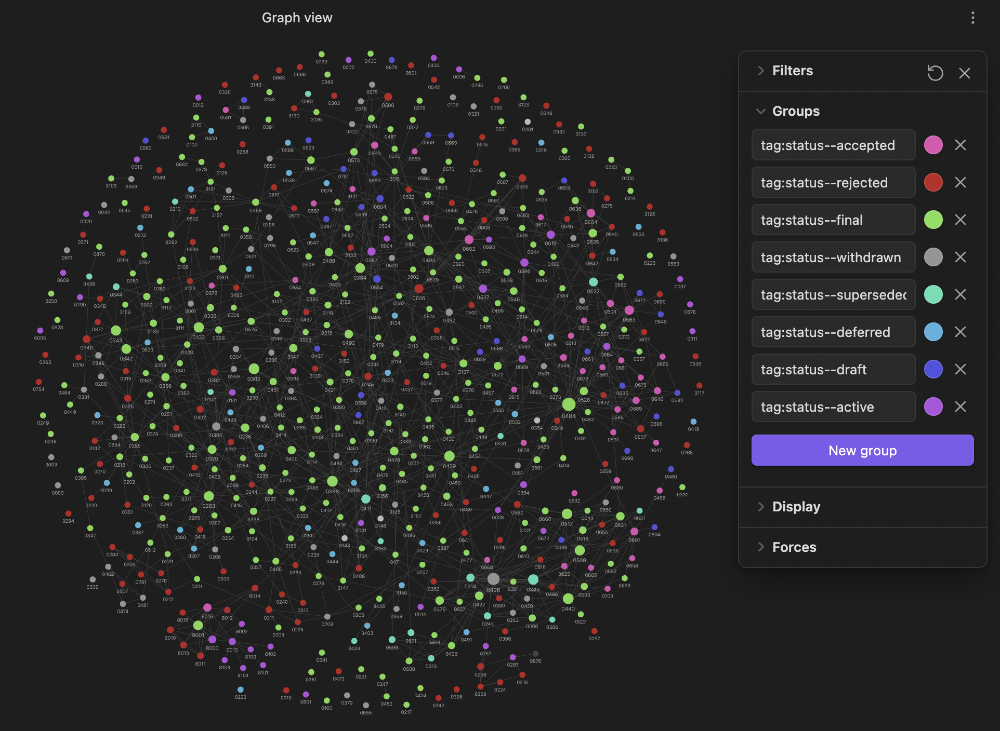

# PEP connections

This is a toy project for parsing the contents of PEP files in [python/peps](https://github.com/python/peps) and outputting connected Markdown files fit for consumption in [Obsidian](https://obsidian.md).

## Usage

1. Put the `connect.py` script in a directory alongside the PEP `.txt`/`.rst` files
1. Run the `connect.py` script
1. Open the newly-created `output/` directory as an Obsidian vault

## Examples

