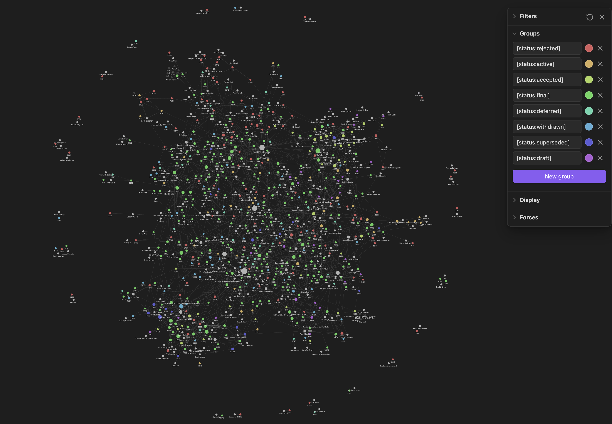

# PEP connections

This is a toy project for parsing the contents of PEP files in [python/peps](https://github.com/python/peps) and outputting connected Markdown files fit for consumption in [Obsidian](https://obsidian.md).

## Usage

1. Put the `connect.py` script in a directory alongside the PEP `.txt`/`.rst` files
1. Run the `connect.py` script
1. Open the newly-created `output/` directory as an Obsidian vault

## Examples




## Development

This project uses [tox](https://tox.wiki).

### Run tests

```shell
$ tox
```

### Type check

```shell
$ tox -e typecheck
```

### Lint

```shell
$ tox -e lint
```

### Format

```shell
$ tox -e format  # to check
$ tox -e format -- .  # to fix
```
